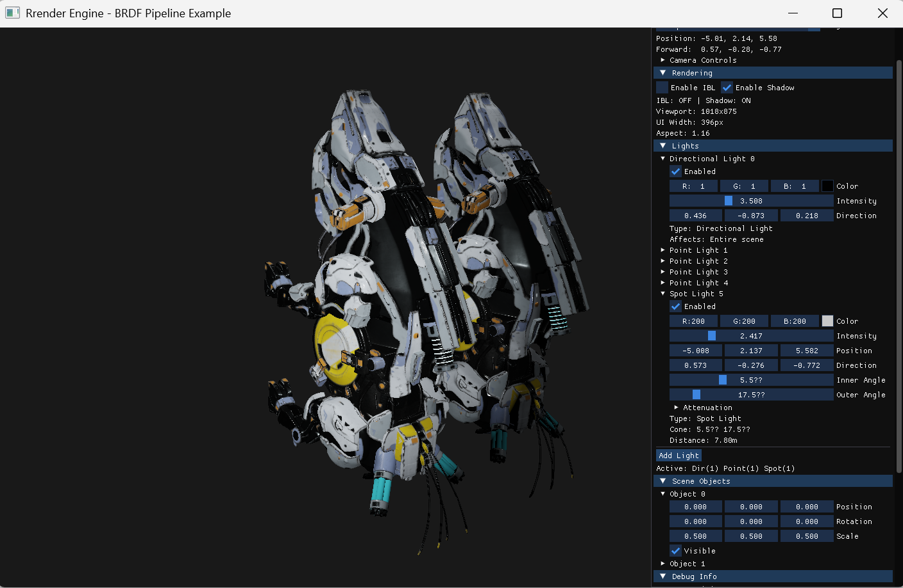

# Rrender - 基于OpenGL的硬光栅渲染器

一个现代化的基于物理的渲染器，使用C++和OpenGL实现，支持PBR材质、多种光源类型、阴影映射和IBL环境光照。


## 功能特性

### 渲染功能
- **基于物理的渲染 (PBR)**：实现完整的BRDF材质系统
- **多种光源支持**：
  - 方向光 (Directional Light)
  - 点光源 (Point Light) 
  - 聚光灯 (Spot Light)
- **阴影映射**：支持所有光源类型的实时阴影
- **基于图像的光照 (IBL)**：环境光照和反射
- **HDR渲染**：支持高动态范围颜色和光照

### 相机系统
- **透视/正交投影**：可切换的投影模式
- **自由相机控制**：WASD移动，鼠标旋转
- **可调参数**：FOV、近远平面、移动速度、鼠标灵敏度

### 用户界面
- **实时UI控制面板**：使用ImGui构建
- **双模式切换**：TAB键切换相机控制/UI交互模式
- **响应式布局**：根据窗口大小自动调整UI布局
- **紧凑模式**：小窗口下的优化显示

### 输入系统
- **模式化输入管理**：相机控制与UI交互完全分离
- **键盘控制**：
  - `WASD` - 相机移动
  - `TAB` - 切换输入模式
  - `ESC` - 退出程序
- **鼠标控制**：视角旋转和滚轮缩放

## 项目结构

```
Rrender/
├── src/
│   ├── main.cpp           # 程序入口
│   ├── CMakeLists.txt     # 构建配置
│   ├── core/              # 核心系统
│   │   ├── Window.cpp        # 窗口管理
│   │   └── InputManager.cpp # 输入管理
│   ├── graphics/          # 图形相关
│   │   ├── Camera.cpp        # 相机系统
│   │   ├── CameraController.cpp # 相机控制器
│   │   ├── Light.cpp         # 光源系统
│   │   ├── Shader.cpp        # 着色器管理
│   │   ├── Material.cpp      # 材质系统
│   │   ├── Mesh.cpp          # 网格数据
│   │   ├── Model.cpp         # 模型加载
│   │   └── Texture.cpp       # 纹理管理
│   ├── pipeline/          # 渲染管道
│   ├── renderPass/        # 渲染通道
│   │   ├── IBLPass.cpp       # IBL预处理通道
│   │   └── ShadowPass.cpp    # 阴影渲染通道
│   ├── resource/          # 资源管理
│   │   └── ResourceManager.cpp # 资源加载管理
│   ├── scene/             # 场景管理
│   │   └── ...               # 场景相关文件
│   ├── ui/                # 用户界面
│   │   └── ...               # UI管理文件
│   └── utils/             # 工具类
│       └── ...               # 实用工具函数
├── include/               # 头文件目录
├── assets/               # 资源文件
│   ├── objects/             # 3D模型文件
│   ├── textures/            # 纹理贴图
│   └── VerticesData.h       # 顶点数据定义
├── shaders/              # GLSL着色器
│   └── alpha/               # 着色器文件
└── CMakeLists.txt        # 根目录构建配置
```

## 编译要求

### 依赖库
- **OpenGL 4.0+**
- **GLFW 3.3+** - 窗口和输入管理
- **GLAD** - OpenGL加载器
- **GLM** - 数学库
- **ImGui** - 即时模式GUI
- **Assimp** - 3D模型加载库（推测）
- **stb_image** - 图像加载库（推测）

### 编译器
- **C++17** 或更高版本
- 支持的编译器：GCC, Clang, MSVC
- **CMake 3.10+** - 构建系统

## 使用方法

### 基本操作
1. 启动程序后，默认进入**相机控制模式**
2. 使用 `WASD` 键移动相机
3. 鼠标移动控制视角
4. 按 `TAB` 切换到**UI模式**进行参数调整
5. 按 `ESC` 退出程序

### UI控制面板

#### Camera Settings（相机设置）
- **投影模式**：透视/正交切换
- **相机参数**：FOV、近远平面、移动速度等
- **实时位置显示**：当前相机位置和朝向

#### Rendering（渲染设置）
- **IBL开关**：启用/禁用基于图像的光照
- **阴影开关**：启用/禁用实时阴影
- **视口信息**：当前渲染分辨率和宽高比

#### Lights（光源控制）
- **光源管理**：添加、删除、启用/禁用光源
- **光源参数**：
  - 颜色和强度（支持HDR）
  - 位置和方向
  - 衰减参数（点光源/聚光灯）
  - 锥角设置（聚光灯）

#### Debug Info（调试信息）
- **性能监控**：FPS和帧时间
- **场景统计**：光源数量、物体数量
- **窗口信息**：分辨率和UI布局信息

## 技术特性

### 渲染技术
- **Cook-Torrance BRDF**：工业标准的PBR材质模型
- **多重散射补偿**：更真实的材质表现
- **环境遮蔽**：增强场景深度感
- **色调映射**：HDR到LDR的转换

### 性能优化
- **视锥剔除**：只渲染可见物体
- **光源剔除**：动态光源数量管理
- **纹理压缩**：减少显存使用
- **批量渲染**：减少绘制调用

### 架构设计
- **模块化设计**：清晰的组件分离
- **RAII资源管理**：自动内存和OpenGL资源管理
- **事件驱动**：输入和窗口事件处理
- **现代C++**：使用智能指针和RAII

## TODO

### 短期目标
- [ ] 添加材质编辑器
- [ ] 支持模型加载（FBX/OBJ/glTF）
- [ ] 实现后处理效果（泛光、景深等）
- [ ] 添加天空盒渲染

### 中期目标
- [ ] 延迟渲染管道
- [ ] 屏幕空间反射 (SSR)
- [ ] 体积光照效果
- [ ] 粒子系统

### 长期目标
- [ ] 光线追踪支持（RTX）
- [ ] 可变速率着色 (VRS)
- [ ] 网格着色器支持
- [ ] Vulkan后端

## 贡献

欢迎提交Issue和Pull Request！

## 许可证

本项目采用MIT许可证。


## 联系方式

*TODO: 添加联系信息*
